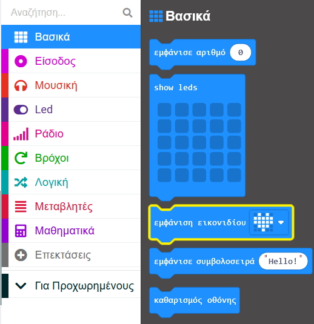
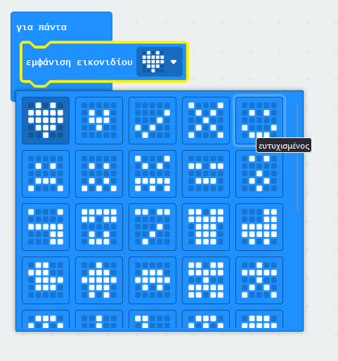

Μπορείς να χρησιμοποιήσεις τα LED για να εμφανίσεις ένα προκατασκευασμένο εικονίδιο (εικόνα).

Μπορείς να βρεις το μπλοκ `εμφάνιση εικονιδίου`{:class='microbitbasic'} στο μενού `Βασικά`{:class='microbitbasic'} στην Εργαλειοθήκη σου.

Υπάρχουν πολλά για να διαλέξεις!

Κάνε κλικ στο εικονίδιο καρδιά στο τέλος του μπλοκ `εμφάνιση εικονιδίου`{:class='microbitbasic'}.

Θα δεις ένα αναπτυσσόμενο μενού, με όλα τα διαθέσιμα προκατασκευασμένα εικονίδια.

Επίλεξε ένα εικονίδιο που σου αρέσει!
