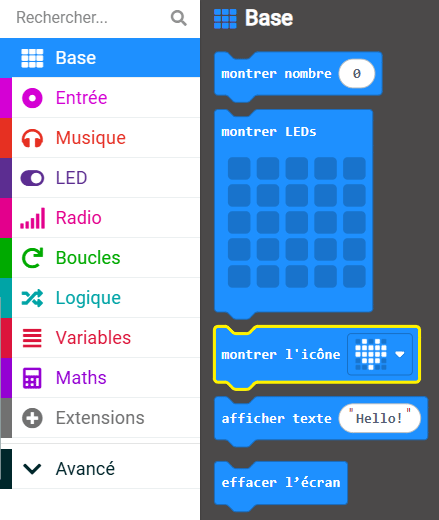
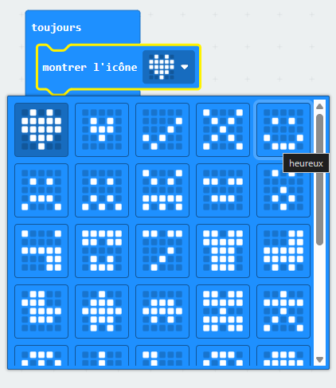

Tu peux utiliser les LED pour afficher une icône prédéfinie (image).

Tu peux trouver le bloc `montrer l'icône`{:class='microbitbasic'} dans le menu `Base`{:class='microbitbasic'} dans ta boîte à outils.

Tu as l'embarras du choix !

Clique sur l'icône en forme de cœur à la fin du bloc `montrer l'icône`{:class='microbitbasic'}.

Tu verras un menu déroulant avec toutes les icônes prédéfinies disponibles.

Choisis une icône que tu aimes !
