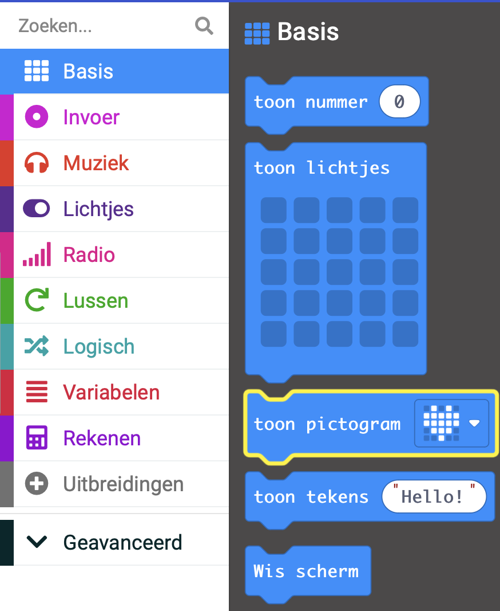
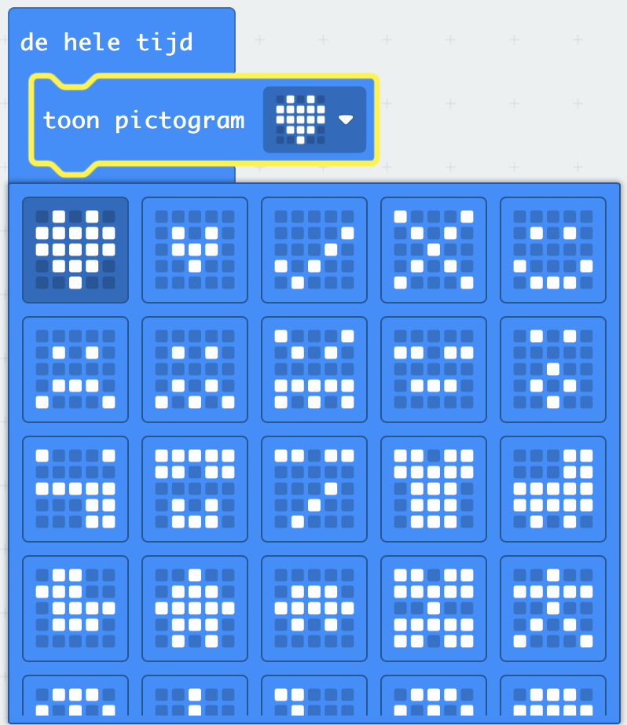

Je kunt de LED's gebruiken om een kant-en-klaar pictogram (afbeelding) weer te geven.

Je kunt het blok `toon lichtjes`{:class='microbitbasic'} vinden in het `Basis`{:class='microbitbasic'} menu in je Toolbox.

Er zijn er heel veel waaruit je kunt kiezen!

Klik op het hartpictogram aan het einde van het `toon pictogram`{:class='microbitbasic'} blok.

Je ziet een vervolgkeuze met alle beschikbare kant-en-klare pictogrammen.

Kies een pictogram dat je leuk vindt!
